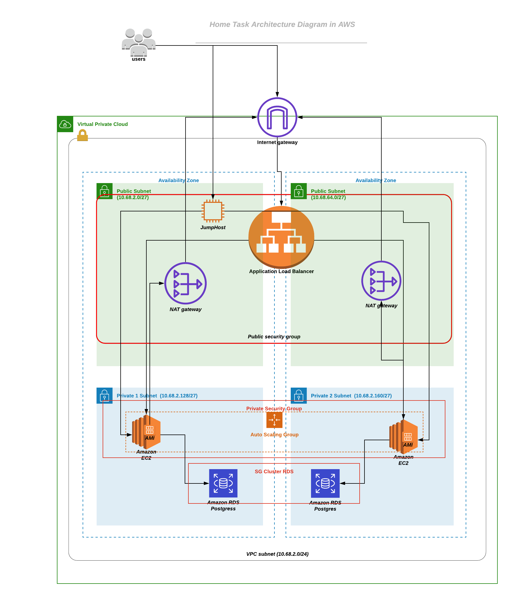

## Terraform Configuration for Hello World App
This Repo will deploy the infrastructure needed to Deploy the Hello World app in AWS using the ./start.sh script. It will apply init/validate/apply terraform. Use the output generated by terraform to replace contents of other config files for the application to start-up.
Due to the open end nature of the task, i made some simplifications to make the project run where ever it will be tested. I personally really enjoyed working on this task and knowing there are number of ways to do e.g using ECR and deploying it in EKS cluster, i wanted to show my understanding of the cloud infrastructure and software development.

## Architecture 



## Technologies:
- Java
- Ansible
- Bash Scripting
- AWS RDS Postgres
- AWS Autoscaling Group
- AWS VPC
- AWS IAM
- AWS ALB
- AWS EC2

## Prerequisites

- terraform > 0.12	
- awscli
- ansible
- aws existing key pair
- aws s3 bucket (if state files are to be stored remotely)

## Installation 

Install prerequisites,
  - brew install ansible
  - brew install terraform
  - brew install awscli

Configure `awscli` with access key and secret,
```
aws configure
ssh-add -k {$key_pair} aws generated
ssh-add -l
```

```
git clone https://github.com/hassanejaz/task-infra.git
./start
```

## Testing in Cloud

Replace the alb_dns with the output of ALB DNS name when the start script is ran to test

```
curl -X PUT http://${alb_dns}:8080/hello/hassan -H "Content-Type: application/json" -d '{"dateOfBirth":"1998-02-21"}'
curl -X GET http://${alb_dns}:8080/hello/hassan
```


## Testing Locally
```
git clone https://github.com/hassanejaz/java-app.git
docker-compose up -d
curl -X PUT http://localhost:8080/hello/hassan -H "Content-Type: application/json" -d '{"dateOfBirth":"1998-02-21"}'
curl -X GET http://localhost:8080/hello/hassan
```

## Folder Structure
```
 |-README.md
 |-env
 | |-outputs.tf
 | |-main.tf
 | |-config.tf
 | |-output.txt
 |-ansible
 | |-playbook.yaml
 | |-aws_hosts
 | |-configure.sh
 | |-ping.yaml
 |-.gitignore
 |-modules
 | |-jumpbox
 | | |-output.tf
 | | |-jumpbox.tf
 | | |-userdata.sh
 | | |-variables.tf
 | |-vpc-basic
 | | |-output.tf
 | | |-variables.tf
 | | |-vpc.tf
 | |-alb
 | | |-outputs.tf
 | | |-variables.tf
 | | |-alb.tf
 | |-aurora-postgresql
 | | |-outputs.tf
 | | |-postgres.tf
 | | |-README.md
 | | |-scripts
 | | | |-get-latest-cluster-snapshot-id.sh
 | | |-variables.tf
 | |-iam
 | | |-iam.tf
 | |-sg
 | | |-output.tf
 | | |-variables.tf
 | | |-sg.tf
 | |-asg-basic
 | | |-userdata.tpl
 | | |-outputs.tf
 | | |-main.tf
 | | |-variables.tf
 |-start.sh
 |-architecture.png
```
## Caveats/Notes

- I tested the infrastructure using AWS region us-east-1 hence the ami version are from that region. If its deployed in different region then it would need replacing to suitable ubuntu image of the region. P.S: All the regions ami could be mapped using terraform like below

```
variable "ami_mapping" {
  type = "map"
  default = {
    us-east-2    = "XXXX"
    eu-west-1    = "XXXX"
    us-west-2    = "XXXX"
  }
}
```

- Jumpbox has a public IP which isn't the best practise but for the purpose of the exercise where it can be cloned and ran with the script in seconds i left that open. Solution obviously would be to restrict it to local IP of the machine where the repo will be ran.

- Give path in the aws_hosts file for the key pair for ansible to run 

```
 ansible_ssh_common_args= '-o ProxyCommand="ssh -i ${key_pair} -W %h:%p -q ubuntu@X.X.X.X"'
```

- Sed command IF using any other OS other than MAC please include remove '' at sed commands in the start.sh script
